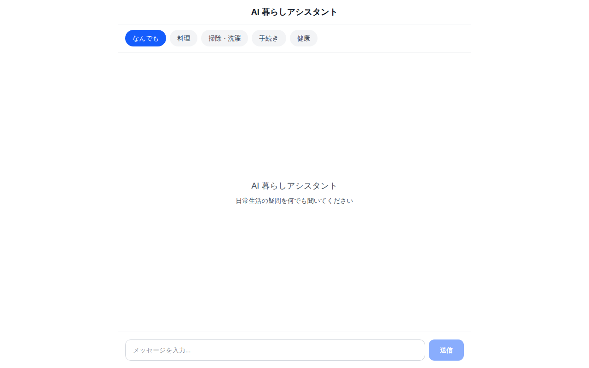
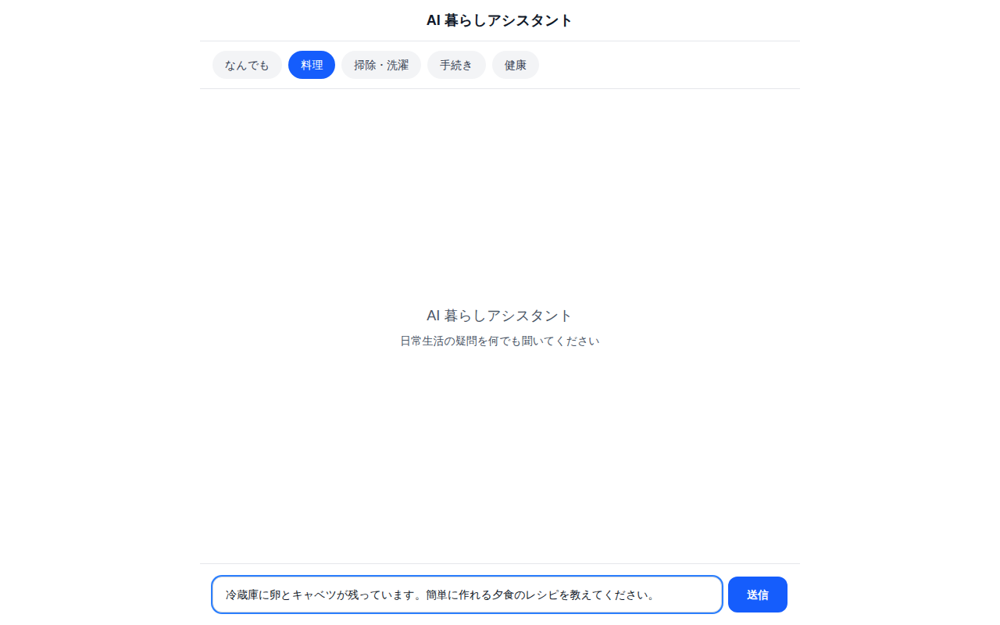
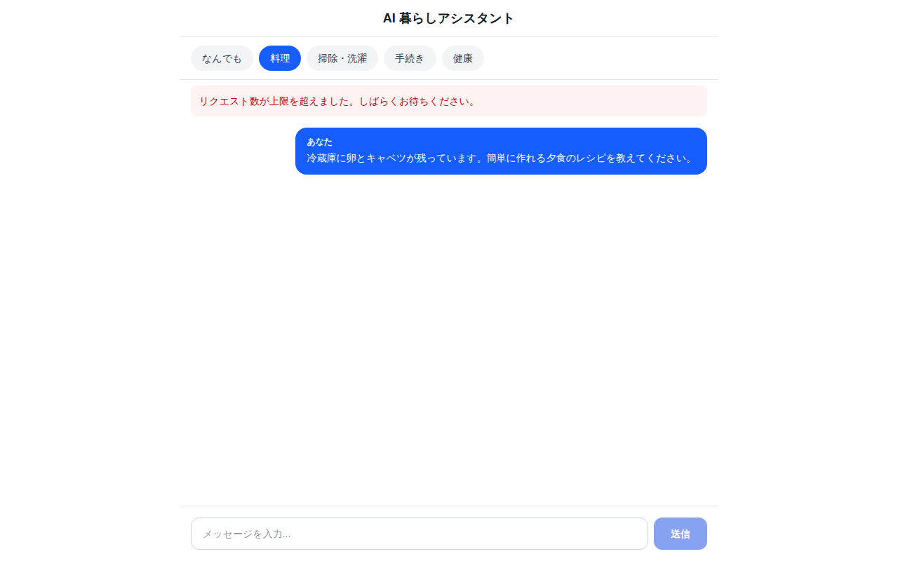
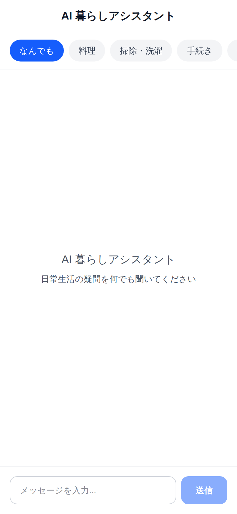

# AI 暮らしアシスタント

日常生活のちょっとした疑問や悩みを AI がサポートするチャットアプリです。

## デモ

代表フロー「カテゴリ選択 → 質問入力 → ストリーミング回答」のデモ GIF です
（課金を避けるため、上流 Claude API をスタブした撮影経路 `node scripts/capture-demo.mjs` で撮影。回答内容はデモ用のダミーです）。


主要画面のスクリーンショットです
（同じくスタブ経路の `node scripts/capture-screenshots.mjs` で自動撮影。質問内容はデモ用のダミーです）。

| 初期画面（カテゴリ選択） | 質問入力（「料理」カテゴリ選択中） |
|---|---|
|  |  |

| エラー表示（レート制限超過時） | モバイル表示 |
|---|---|
|  |  |

## どんなアプリ？

「冷蔵庫の残り物で何作れる？」「引っ越しの手続き、何からやればいい？」「このシミの落とし方は？」——
日々の暮らしで浮かぶ疑問を、AI がチャット形式でわかりやすく回答します。

### 主な機能

- **チャット UI** — メッセージを送ると AI がリアルタイムで回答（ストリーミング表示）
- **カテゴリ別プロンプト** — 料理・掃除・手続き・健康など、生活カテゴリに最適化されたシステムプロンプト
- **会話履歴** — 文脈を維持した連続的な対話が可能
- **レスポンシブ対応** — スマホからでも快適に利用可能

### 今後の拡張候補

- 画像入力（料理の写真からレシピ提案、植物の同定など）
- お気に入り回答の保存
- 音声入力対応
- RAG（自分のメモやレシピ集を読み込んで回答精度向上）

## 技術スタック

| 技術 | 用途 |
|---|---|
| **Next.js 16** (App Router) | フルスタックフレームワーク |
| **TypeScript** | 型安全な開発 |
| **Anthropic Claude API** | AI チャット応答（claude-sonnet-4-6） |
| **Tailwind CSS v4** | スタイリング |

## セットアップ

### 前提条件

- Node.js 20 以上
- npm
- Anthropic API キー（[console.anthropic.com](https://console.anthropic.com/) で取得）

### 手順

```bash
# 依存パッケージのインストール
npm install

# 環境変数の設定
cp .env.example .env.local
# .env.local を開いて ANTHROPIC_API_KEY を設定

# 開発サーバーの起動
npm run dev
```

http://localhost:3000 でアプリが起動します。

## プロジェクト構成（予定）

```
my-first-ai-app/
├── src/
│   ├── app/
│   │   ├── layout.tsx          # ルートレイアウト
│   │   ├── page.tsx            # チャット画面（メインページ）
│   │   └── api/
│   │       └── chat/
│   │           └── route.ts    # Claude API エンドポイント（ストリーミング）
│   ├── components/
│   │   ├── ChatMessage.tsx     # メッセージ吹き出し
│   │   ├── ChatInput.tsx       # 入力フォーム
│   │   ├── ChatContainer.tsx   # メッセージ一覧 + 自動スクロール
│   │   └── CategoryChips.tsx   # カテゴリ選択チップ
│   ├── lib/
│   │   ├── anthropic.ts        # Anthropic クライアント初期化
│   │   ├── prompts.ts          # カテゴリ別システムプロンプト定義
│   │   └── types.ts            # 共通型定義
│   └── styles/
│       └── globals.css         # Tailwind + カスタムスタイル
├── public/                     # 静的ファイル
├── .env.example                # 環境変数テンプレート
├── CLAUDE.md                   # 開発ルール
├── package.json
├── tsconfig.json
├── next.config.ts
├── tailwind.config.ts
└── README.md
```

## コマンド一覧

```bash
npm run dev          # 開発サーバー起動
npm run build        # プロダクションビルド
npm run start        # プロダクション起動
npm run lint         # ESLint
npm run typecheck    # 型チェック（tsc --noEmit）
npm run test         # テスト実行
npm run test:e2e     # E2E テスト（Playwright）
```

## デプロイ

Vercel にデプロイ可能です:

1. [vercel.com](https://vercel.com) でリポジトリを接続
2. 環境変数 `ANTHROPIC_API_KEY` を設定
3. デプロイ

### Docker（ローカル/サーバー向け）

```bash
# ビルド
docker build -t my-first-ai-app:latest .

# 起動（Anthropic の API キーを渡す）
docker run --rm -p 3000:3000 \
  -e ANTHROPIC_API_KEY="your-key" \
  my-first-ai-app:latest
```

## ブランチ運用（推奨）

`main` を default branch にする運用を推奨します。

- GitHub: **Settings → Branches → Default branch** で `main` を選択
- 可能なら branch protection（CI必須）も有効化

## セキュリティ

- `docs/SECURITY.md`

## ライセンス

MIT
